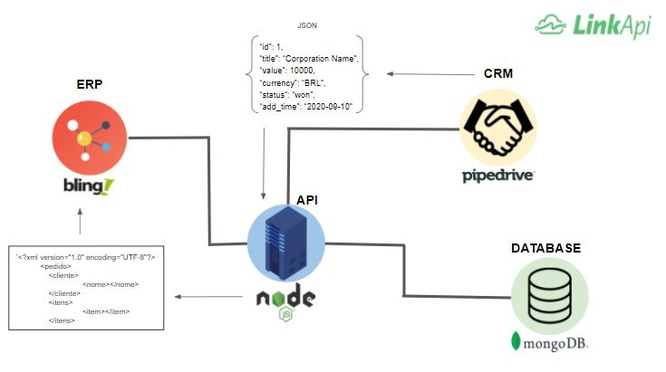

# Pipedrive and Bling Integration

### API Flow


### Context
Pipedrive and Bling Integration is an Api with focus in create an integration between a CRM and an ERP system. It's a good option to get and insert information in a easy way. The API also save the information in a MongoDb database.


### Technologies
- Node.Js@10.16.3
- Express.js@4.17.1
- Axios@0.20.0
- MongoDb@4.2.0
- Mongoose@5.10.4

### Executing

To execute the Api and test it for yourself, please follow steps below:

You can get this code making a clone for this repository
```sh
    $ git clone https://github.com/Lucasoliveira1997/api-integration-pipedrive-bling.git
```

Install the dependecies and dev-dependencies to run the server.
```sh
    $ npm install
```

To start the server and access the API on port 3000:
```sh
    $ npm start
```

You can access information about customers into the integration accessing the endpoint:
```sh
    $ GET - http://localhost:3000/opportunities
```

The route above make a connection and insert data on MongoDB database, you can access then:
```sh
    $ GET - http://localhost:3000/orders
```